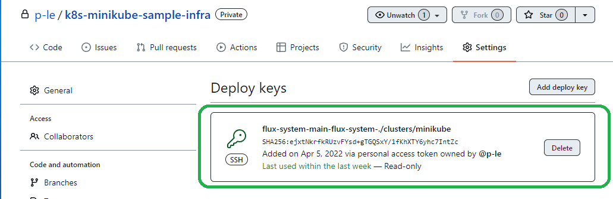

# Lab 004

**Nội dung**: Các bạn sẽ làm quen **[FluxCD](https://fluxcd.io/docs/get-started/)** trên môi trường development với Minikube

Flux cung cấp các chức năng liên quan tới Continuous Delivery (CD) với Kubernetes Cluster.

Về bản chất, FluxCD hoạt động dựa trên **[GitOps](https://www.gitops.tech/)** là một cách quản lý Infrastructure và Applications theo hướng tiếp cận lập trình khai báo (declarative programming) cùng với source code version control. GitOps cũng bao gồm các tiến trình (process) đã được tự động hóa để đảm bảo rằng trạng thái của environment được quản lý luôn luôn khớp với trạng thái được định nghĩa trong repository.

**NOTE:**: Trong Labs 004 này, Các bạn cũng có thể xem xét sử dụng **[kind](https://kind.sigs.k8s.io/docs/user/quick-start/)** để khởi tạo một Kubernetes Cluster trên môi trường Development.

## 1. Chuẩn bị

Yêu cầu: Các bạn đã đọc qua và hoàn tất

**[Getting Started](../../docs/getting_started.md)**: Khởi tạo Minikube Cluster, cài đặt **[kubectl](https://kubernetes.io/docs/tasks/tools/)**

## 2. Thực hành

### Step 1: Cài đặt Flux CLI

Các bạn có thể sử dụng script **[install-fluxcd.sh](../../tools/install-fluxcd.sh)** (Trên Linux) mà mình đã trang bị hoặc tham khảo: **[Install the Flux CLI](https://fluxcd.io/docs/installation/#install-the-flux-cli)**

```
$ ./tools/install-fluxcd.sh

[INFO]  Downloading metadata https://api.github.com/repos/fluxcd/flux2/releases/latest
[INFO]  Using 0.28.5 as release
[INFO]  Downloading hash https://github.com/fluxcd/flux2/releases/download/v0.28.5/flux_0.28.5_checksums.txt
[INFO]  Downloading binary https://github.com/fluxcd/flux2/releases/download/v0.28.5/flux_0.28.5_linux_amd64.tar.gz
[INFO]  Verifying binary download
[INFO]  Installing flux to /usr/local/bin/flux
```

Sau đó có thể kiểm tra nhanh bằng command: `flux version --client`

```
$ flux version --client

flux: v0.28.5
```

Kết quả trả về như này là OK :white_check_mark:

## Step 2: Cài đặt [GitHub CLI](https://cli.github.com/)

Sử dụng GitHub CLI giúp các bạn có thể quản lý GitHub Repositories và nhiều settings khác thông qua command line, rất tiện lợi.

Các bạn có thể cài đặt bằng script **[install-githubcli.sh](../../tools/install-githubcli.sh)** (Trên Linux)

```
$ ./tools/install-githubcli.sh
```

Sau khi cài đặt xong thì kiểm tra với command

```
$ gh version

gh version 2.7.0 (2022-03-30)
https://github.com/cli/cli/releases/tag/v2.7.0
```

Và cuối cùng, các bạn sẽ cần authorize GitHub CLI với tài khoản GitHub của bạn

**NOTE:** Trong môi trường của mình, thì mình đã authoirze GitHub CLI rồi nên output sẽ ra hơi khác.

```
$ gh auth login

? What account do you want to log into? GitHub.com
? You're already logged into github.com. Do you want to re-authenticate? No
```

### Step 3: Cài đặt FluxCD vào Minikube Cluster

Đầu tiên, để cài đặt FluxCD liên kết với GitHub các bạn cần

- Chuẩn bị **[GitHub Personal Access Token](https://docs.github.com/en/authentication/keeping-your-account-and-data-secure/creating-a-personal-access-token)** để sử dụng với Flux CLI và cấp quyền cho Flux CLI quản lý Repository
- Tiếp theo, thay thế: `<PERSONAL-ACCESS-TOKEN>` `<GITHUB-USER>` trong command sau:

```
$ export GITHUB_TOKEN=<PERSONAL-ACCESS-TOKEN>
$ export GITHUB_USER=<GITHUB-USER>

$ flux bootstrap github \
    --owner=$GITHUB_USER \
    --repository=k8s-minikube-sample-infra \
    --path=clusters/minikube \
    --personal
```

- `--owner`: tên GitHub User của bạn.
- `--repository`: tên GitHub repository được sử dụng làm nơi lưu trữ trạng thái của cluster (infra code). Trong TH này, FluxCD sẽ tự động tạo 1 repository tên là `<GITHUB-USER>/k8s-minikube-sample-infra` nếu repository này chưa tồn tại.
- `--path`: chỉ định **Directory** trong **Repository** được sử dụng để đồng bộ trạng thái của Cluster với Repository
- `--personal`: chỉ định đây là tài khoản GitHub cá nhân, không phải Organization

<details>
 <summary>Sample Console Output (Click)</summary>
<pre>
► connecting to github.com
✔ repository "https://github.com/p-le/k8s-minikube-sample-infra" created
► cloning branch "main" from Git repository "https://github.com/p-le/k8s-minikube-sample-infra.git"
✔ cloned repository
► generating component manifests
✔ generated component manifests
✔ committed sync manifests to "main" ("3f23de9c78b966d412062db4164130e62c975c5e")
► pushing component manifests to "https://github.com/p-le/k8s-minikube-sample-infra.git"
✔ installed components
✔ reconciled components
► determining if source secret "flux-system/flux-system" exists
► generating source secret
✔ public key: ecdsa-sha2-nistp384 AAAAE2VjZHNhLXNoYTItbmlzdHAzODQAAAAIbmlzdHAzODQAAABhBNbzuE7y2A8JLnQt0kjCxnTmEsFxjAfIlv5KM733Ax3tWLt23X/ewaDYyyzezE3PKO7rXcHh1TZod5uCTvG52X0is8WsYx+wWEVRZWUiaqTSGyWDUiSTLC1XwWqBu6x3Ow==
✔ configured deploy key "flux-system-main-flux-system-./clusters/minikube" for "https://github.com/p-le/k8s-minikube-sample-infra"
► applying source secret "flux-system/flux-system"
✔ reconciled source secret
► generating sync manifests
✔ generated sync manifests
✔ committed sync manifests to "main" ("443b1435ba411aedf55d9029024311a777c0a4cf")
► pushing sync manifests to "https://github.com/p-le/k8s-minikube-sample-infra.git"
► applying sync manifests
✔ reconciled sync configuration
◎ waiting for Kustomization "flux-system/flux-system" to be reconciled
✔ Kustomization reconciled successfully
► confirming components are healthy
✔ helm-controller: deployment ready
✔ kustomize-controller: deployment ready
✔ notification-controller: deployment ready
✔ source-controller: deployment ready
✔ all components are healthy
</pre>
</details>
<br />

### Step 4: Kiểm tra

Sau khi bootstrap FluxCD với GitHub xong, các bạn có thể mở GitHub Repository `k8s-minikube-sample-infra` và mở phần Settings và có thể thấy rằng:

- Trong quá trình Bootstrap, FluxCD đã tự động tạo ra 1 SSH Key và config Deploy Key vào target Repository

<br />

<br />

- Kiểm tra Namespace trong Minikube Cluster, sẽ có 1 Namespace là `flux-system` được thêm vào.

```
$ kubectl get ns

NAME                   STATUS   AGE
default                Active   2d23h
flux-system            Active   109m
kube-node-lease        Active   2d23h
kube-public            Active   2d23h
kube-system            Active   2d23h
kubernetes-dashboard   Active   2d13h
```

- Kiểm tra các Pods trong namespace `flux-system`. Các bạn sẽ thấy các controller của FluxCD

```
$ kubectl get pods -n flux-system

NAME                                      READY   STATUS    RESTARTS   AGE
helm-controller-dfb4b5478-mvrxz           1/1     Running   0          113m
kustomize-controller-cd544c8f8-pbncb      1/1     Running   0          113m
notification-controller-d9cc9bf46-6m7nk   1/1     Running   0          113m
source-controller-84bfd77bf8-429ns        1/1     Running   0          113m
```

**Step 6:** Thử Update Cluster
Đầu tiên các bạn sẽ cần phải clone repository `k8s-minikube-sample-infra` bằng GitHub CLI.

```
$ gh repo clone k8s-minikube-sample-infra
```

Sau đó, copy Kubernetes Manifest Files từ **[Labs-001](../001-laravel-app-minikube/)** sử dụng command **[cp](https://man7.org/linux/man-pages/man1/cp.1.html)** vào thử mục `clusters/minikube/default`

```
$ cd k8s-minikube-sample-infra
$ mkdir -p clusters/minikube/default
$ cp -R ../../001-laravel-app-minikube/manifests/* clusters/minikube/default/
```

Sau đó các bạn sẽ phải thêm file `kustomization.yaml` vào folder `clusters/minikube/default`

Đây là file của công cụ: [Kustomize](https://kustomize.io/). Là công cụ đơn giản hơn Helm cung cấp chức năng Templating phục vụ quản lý Kubernetes Manifest Files

```
apiVersion: kustomize.config.k8s.io/v1beta1
kind: Kustomization
resources:
- mysql-configmap.yaml
- mysql-statefulset.yaml
- mysql-service.yaml
- laravel-deployment.yaml
- laravel-service.yaml
```

Lúc này thì Repository sẽ có structure như sau:

```
└── clusters
    └── minikube
        ├── default
        │   ├── kustomization.yaml
        │   ├── laravel-deployment.yaml
        │   ├── laravel-service.yaml
        │   ├── mysql-configmap.yaml
        │   ├── mysql-service.yaml
        │   └── mysql-statefulset.yaml
        └── flux-system
            ├── gotk-components.yaml
            ├── gotk-sync.yaml
            └── kustomization.yaml
```

Tiếp theo, các bạn chỉ cần commit/push manifests file lên remote và chờ Flux reconcile lại state của Infrastructure

```
$ git add -A
$ git commit -m "Add Laravel Manifest Files"
$ git push origin main
```

Mặc định Source Controller của FluxCD sẽ có interval 1 phút giữa các lần reconcile (sync lại với Repository), nên các bạn sẽ phải chờ một chút nhé.

Và cuối cùng các bạn có thể kiểm tra tương tự như **[Labs 001](../001-laravel-app-minikube/)**

## 3. Clean up

Sự dụng command sau để xóa tất cả thay đổi trên Minikube Cluster

```
$ minikube delete --purge
$ gh repo delete p-le/k8s-minikube-sample-infra
```
